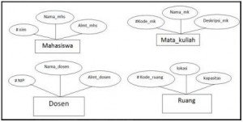
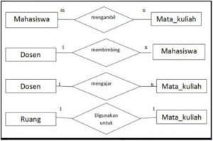
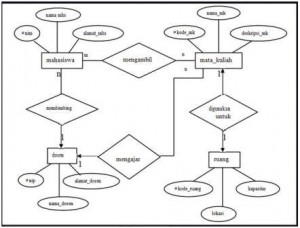

**Studi Kasus Tahapan** **Cara Membuat ERD**

Berikut ini adalah contoh tahapan dalam membuat ERD pada Sistem
Informasi Akademik.

**Tahap 1: Penentuan Entities**

**Tahap 2 : Penentuan Atribut**

**Mahasiswa**:

-   nim: nomor induk mahasiswa (integer) PK

-   nama\_mhs: nama lengkap mahasiswa (string)

-   alamat\_mhs: alamat lengkap mahasiswa (string)

**Dosen**:

-   nip: nomor induk pegawai (integer) PK

-   nama\_dosen: nama lengkap dosen (string)

-   alamat\_dosen: alamat lengkap dosen (string)

**Mata\_kuliah**:

-   kode\_mk: kode untuk mata kuliah (integer) PK

-   nama\_mk: nama lengkap mata kuliah (string)

-   deskripsi\_mk: deskripsi singkat mengenai mata kuliah (string)

**Ruang**:

-   kode\_ruang: kode untuk ruang kelas (string) PK

-   lokasi\_ruang: deskripsi singkat mengenai lokasi ruang
    kelas (string)

-   kapasitas\_ruang: banyaknya mahasiswa yang dapat ditampung (integer)

**Tahap 3 : Penentuan Kardinalitas Relasi**

Hubungan :

**a.  ruang** digunakan untuk **mata\_kuliah**:

-   Tabel utama: **ruang**

-   Tabel kedua: **mata\_kuliah**

-   Relationship: One-to-one (1:1)

-   Attribute penghubung: **kode\_ruang** (FK **kode\_ruang** di
    **mata\_kuliah**)

**b.  dosen** mengajar **mata\_kuliah**:

-   Tabel utama: **dosen**

-   Tabel kedua: **mata\_kuliah**

-   Relationship: One-to-many (1:n)

-   Attribute penghubung: **nip** (FK **nip** di **mata\_kuliah**)

**c.  dosen** membimbing **mahasiswa**:

-   Tabel utama: **dosen**

-   Tabel kedua: **mahasiswa**

-   Relationship: One-to-many (1:n)

-   Attribute penghubung: **nip** (FK **nip** di **mahasiswa**)

**d.  mahasiswa** mengambil **mata\_kuliah**:

-   Tabel utama: **mahasiswa, mata\_kuliah**

-   Tabel kedua: **mhs\_ambil\_mk**

-   Relationship: Many-to-many (m:n)

-   Attribute penghubung: **nim**, **kode\_mk** (FK **nim**,
    **kode\_mk** di **mhs\_ambil\_mk**)

**Tahap 4 : Pembuatan ERD**

Untuk lebih jelasnya teman-teman bisa mencari informasi yang lebih
detail dengan mempelajari buku-buku tentang Perancangan Basis Data,
berikut ada beberapa referensi buku yang dapat dijadikan acuan dalam
mempelajari Perencangan Basis Data.
